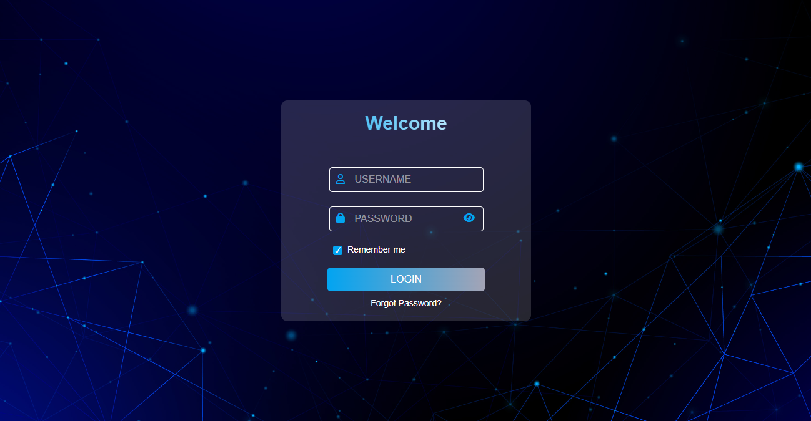

# 🌐 Responsive Login Page with Validation and Remember Me

This is a modern, responsive login page built using **HTML**, **CSS**, and **JavaScript**. It includes real-time validation, password visibility toggling, error animations, and a "Remember Me" feature using localStorage.

## 🔧 Features

- 🎨 Clean and responsive UI
- ✅ Username & password validation
- 🔒 Password visibility toggle
- ⚠️ Error messages with shake animation
- 💾 "Remember Me" with localStorage
- 👁 Font Awesome icons integrated
- 📱 Mobile responsive design

## 🖥️ Tech Stack

- **HTML5**  
- **CSS3**  
- **Vanilla JavaScript**  
- **Font Awesome** (via CDN)

## 📁 File Structure

📂 login-form-project
├── index.html
├── style.css
├── script.js
└── images/
└── login-background.jpg
└── login-page.png

## 🚀 How to Use

1. **Clone or Download** the repository.
2. Open `index.html` in your browser.
3. Interact with the form:
   - Enter username and password
   - Try incorrect inputs to see validations
   - Toggle password visibility
   - Check "Remember Me" and refresh the page

## ⚠️ Note

> This project is **frontend-only** and does not include backend authentication. Passwords are stored in `localStorage` **only for demonstration purposes** — not recommended in real applications.

## 📸 Screenshots

 

## 📚 Future Improvements

- Backend authentication with Node.js / Express
- Toggle between Login and Register forms
- Integrate with Firebase or MongoDB

## 👩‍💻 Author

Poornima C – [https://github.com/Poornima-2121](#) | [https://www.linkedin.com/in/aminroop43/](#)

---

